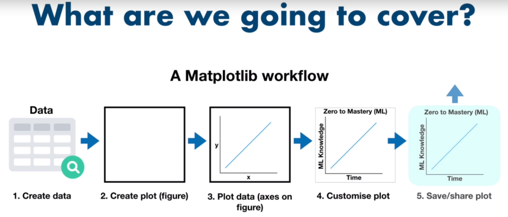

---
jupyter:
  jupytext:
    formats: ipynb,md,py:percent
    text_representation:
      extension: .md
      format_name: markdown
      format_version: '1.2'
      jupytext_version: 1.4.1
  kernelspec:
    display_name: Python 3
    language: python
    name: python3
---

```python
import pandas as pd
import numpy as np
from jupyterthemes import jtplot
from IPython.core.display import display, HTML

display(HTML("<style>.container { width:80% !important; }</style>"))
jtplot.style()
```

# matplotlib CookBook


* [Question](https://github.com/mrdbourke/zero-to-mastery-ml/blob/master/section-2-data-science-and-ml-tools/matplotlib-exercises.ipynb)  
* [Answer](https://github.com/mrdbourke/zero-to-mastery-ml/blob/master/section-2-data-science-and-ml-tools/matplotlib-exercises-solutions.ipynb)


### Why matplotlib?
---
* Built on NumPy arrays (and Python)
* Integrates directly with pandas
* Can create basic or advanced plots
* Simple to use interface (once you get the foundations)



* Importing Matplotlib and the 2 ways of plotting
* Plotting data from NumPy arrays
* Plotting data from pandas DataFrames
* Savihng and sharing plots
