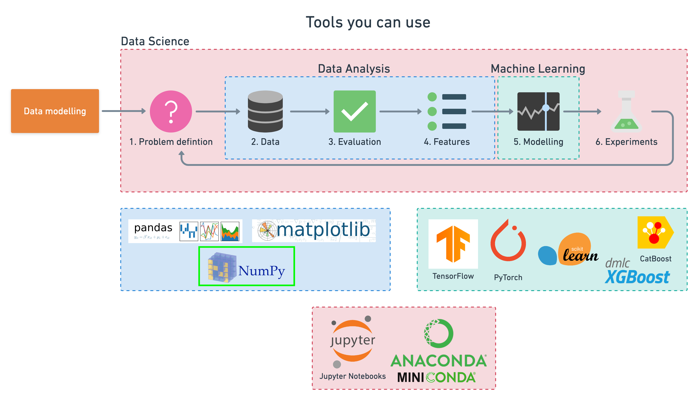

---
jupyter:
  jupytext:
    formats: ipynb,md,py:percent
    text_representation:
      extension: .md
      format_name: markdown
      format_version: '1.2'
      jupytext_version: 1.4.1
  kernelspec:
    display_name: Python 3
    language: python
    name: python3
---

```python
import numpy as np
from jupyterthemes import jtplot
from IPython.core.display import display, HTML

display(HTML("<style>.container { width:70% !important; }</style>"))
jtplot.style()
```

# NumPy CookBook


<a name='ch_index'></a>


* [Question](https://github.com/mrdbourke/zero-to-mastery-ml/blob/master/section-2-data-science-and-ml-tools/numpy-exercises.ipynb)  
* [Answer](https://github.com/mrdbourke/zero-to-mastery-ml/blob/master/section-2-data-science-and-ml-tools/numpy-exercises-solutions.ipynb)


#### Why NumPy?
---
* It's fast (C language)
* Backbone of other Python scientific packages
* Vectorization via broadcasting (avoiding loops)


#### What are we going to cover?
---
* Most userful functions
* NumPy datatypes & attributes (ndarray)
* Creating arrays
* Viewing arrays & matrices
* Sorting arrays
* Use cases


[CH1. NumPy datatypes & attributes](#numpy_datatypes_attributes)<br/>
[CH2. Creating arrays](#creating_arrays)<br/>
[CH3. Viewing arrays & matrices](#viesing_arrays_matrices)<br/>
[CH4. Manipulating & comparing arrays](#manipulating_comparing_arrays)<br/>
[CH5. Sorting arrays](#sorting_arrays)<br/>
[CH6. Use cases](#use_cases)<br/>
[CH7. Diemensions and Axis](#diemension_and_axis)<br/>


## NumPy datatypes & attributes<a name='numpy_datatypes_attributes'></a>
---


* Main datatype is ndarray In NumPy.
* Operation some array, will work on another.

```python
# 1-dimensonal array, also referred to as a vector
a1 = np.array([1, 2, 3])

# 2-dimensional array, also referred to as matrix
a2 = np.array([[1, 2.0, 3.3],
               [4, 5, 6.5]])

# 3-dimensional array, also referred to as a matrix
a3 = np.array([[[1, 2, 3],
                [4, 5, 6],
                [7, 8, 9]],
                [[10, 11, 12],
                 [13, 14, 15],
                 [16, 17, 18]]])
```

* Array - A list of numbers, can be multi-dimensional.
* Scalar - A single number (e.g. 7).
* Vector - A list of numbers with 1-dimesion (e.g. np.array([1, 2, 3])).
* Matrix - A (usually) multi-deminsional list of numbers (e.g. np.array([[1, 2, 3], [4, 5, 6]])).<br/>
[back_index](#ch_index)


## Creating arrays <a name="creating_arrays"></a>
---


* [np.array()](#np.array)
* [np.ones()](#np.ones)
* [np.zeros()](#np.zeros)
* [np.arange()](#np.arange)
* [np.random.rand(5, 3)](#np.random.rand)
* [np.random.randint(10, size=5)](#np.random.randint)
* [np.random.seed() - pseudo random numbers](#np.random.seed)
* [Searching the documentation example (finding np.unique() and using it)](#np.unique)


##### np.array()<a name="np.array"></a>
[see also](https://docs.scipy.org/doc/numpy/reference/generated/numpy.array.html)<br/>
[back](#creating_arrays)

```python
# Create a simple array
simple_array = np.array([1, 2, 3])
simple_array
```

##### np.ones()<a name="np.ones"></a>
[see also](https://docs.scipy.org/doc/numpy/reference/generated/numpy.ones.html)<br/>
[back](#creating_arrays)

```python
# Create an array of ones
ones = np.ones((10, 2))
ones, ones.dtype
```

```python
ones = ones.astype(int)
ones, ones.dtype
```

##### np.zeros()<a name="np.zeros"></a>
[see also](https://docs.scipy.org/doc/numpy/reference/generated/numpy.zeros.html)<br/>
[back](#creating_arrays)

```python
# Create an array of zeros
zeros = np.zeros((5, 3, 3))
zeros
```

##### np.arange()<a name="np.arange"></a>
[see also](https://docs.scipy.org/doc/numpy/reference/generated/numpy.arange.html)<br/>
[back](#creating_arrays)

```python
# Create an array within a range of values
range_array = np.arange(0, 10, 2)
range_array
```

##### np.random.rand()<a name="np.random.rand"></a>
[see also](https://docs.scipy.org/doc/numpy-1.15.1/reference/generated/numpy.random.randint.html)<br/>
[back](#creating_arrays)

```python
# Random 5x3 array of floats (between 0 & 1), similar to above
np.random.random((5, 3))
```

##### np.random.randint()<a name="np.random.randint"></a>
[see also](https://docs.scipy.org/doc/numpy-1.15.1/reference/generated/numpy.random.randint.html)<br/>
[back](#creating_arrays)

```python
# Random array
random_array = np.random.randint(10, size=(5, 3))
random_array
```

##### np.random.seed()<a name="np.random.seed"></a>
[see also](https://docs.scipy.org/doc/numpy-1.15.0/reference/generated/numpy.random.seed.html)<br/>
[back](#creating_arrays)

```python
# Set random seed to 0
np.random.seed(0)

# Make 'random' numbers
np.random.randint(10, size=(5, 3))
```

##### np.unique()<a name="np.unique"></a>
[see also](https://docs.scipy.org/doc/numpy/reference/generated/numpy.unique.html)<br/>
[back](#creating_arrays)

```python
np.random.seed(1)
u1 = np.random.randint(5, size=(5, 3))
u1
```

```python
# Searh unique value from array
np.unique(u1)
```

## Viewing arrays & matrices (indexing)<a name='viesing_arrays_matrices'></a>
___
* array and matrices are both ndarray, they can be viewed in similar ways.
* NumPy arrays get printed from outside to inside. This means the number at the end of the shape comes first, and the number at the start of the shape comes last.<br/>
[back_index](#ch_index)


#### np.shape

```python
a4 = np.random.randint(10, size=[2, 3, 4, 5])
# shape (4d=2, 3d=3, 2d(column)=4, 1d(row)=5)
# axis  (4d=0. 3d=1, 2d(column)=2, 1d(row)=3)
a4.shape
```

```python
# Get only the first 4 numbers of each single vector
a4[:, :, :, :4]
```

#### np.axis <a name='np.axis'></a>
[see np.argmax(ndarray, axis=)](https://docs.scipy.org/doc/numpy/reference/generated/numpy.argmax.html)<br/>
[back](#numpy_datatypes_attributes)<br/>

```python
np.argmax(random_array, axis=0)
```

## Manipulating & comparing arrays <a name='manipulating_comparing_arrays'><a>
___
* Arithmetic
  * +, -, *, /, //, **, %
  * np.exp()
  * np.log()
  * Dot product - np.dot()
  * Broadcasting
* Aggregation
  * np.sum() - faster than .sum(), make demo, np is really fast
  * np.mean()
  * np.std()
  * np.var()
  * np.min()
  * np.max()
  * np.argmin() - find index of minimum value
  * np.argmax() - find index of maximum value
  * These work on all ndarray's
      * a4.min(axis=0) -- you can use axis as well
* Reshaping
  * np.reshape()
* Transposing
  * a3.T
* Comparison operators
  * \>
  * \<  
  * <=  
  * \>=  
  * x != 3  
  * X == 3  
  * np.sum(x > 3)
[back_index](#ch_index)


## Sorting arrays <a name='sorting_arrays'><a>
---
* [np.sort()](#np.sort)
* [np.argsort()](#np.argsort)
* [np.argmax()](#np.argmax)
* [np.argmin()](#np.argmin)  
[back_index](#ch_index)


##### np.sort()<a name="np.sort"></a>
[see also](https://docs.scipy.org/doc/numpy/reference/generated/numpy.sort.html)<br/>
[back](#sorting_arrays)

```python
random_array
```

```python
np.sort(random_array)
```

##### np.argsort()<a name="np.argsort"></a>
[see also](https://docs.scipy.org/doc/numpy/reference/generated/numpy.argsort.html)<br/>
[back](#sorting_arrays)

```python
np.random.seed(5)
a1 = np.random.randint(100, size=[2, 3, 5])
a1
```

```python
# 回傳array 值由小到大排序後的index
np.argsort(a1)
```

##### np.argmax()<a name="np.argmax"></a>
[see also](https://docs.scipy.org/doc/numpy/reference/generated/numpy.argmax.html)<br/>
[back](#sorting_arrays)


## Use cases (examples of turning things into numbers)<a name='use_cases'></a>
---
* Turning an image of a panda into numbers.<br/>

[back_index](#ch_index)

```python
from matplotlib.image import imread

panda = imread('../source/panda.png')
print(type(panda))
```

```python
panda.shape
```

```python
panda
```

## Diemensions and Axis <a name='diemension_and_axis'></a>

[back_index](#ch_index)

```python
np.random.seed(100)
d1 = np.random.randint(10, size=[5])
d2 = np.random.randint(10, size=[4, 5])
d3 = np.random.randint(10, size=[3, 4, 5])
d4 = np.random.randint(10, size=[2, 3, 4, 5])
```

```python
# 1-d
d1
```

```python
print(f'd1.size={d1.shape},di.dimension={d1.ndim}')
```

```python
d1.sum(axis=0)
```

```python
# 2-d
d2
```

```python
print(f'd1.size={d2.shape},di.dimension={d2.ndim}')
```

```python
# sim(axis=1)
  
d2.sum(axis=1), d2.sum(axis=0)
```

```python
# 3-d
d3
```

```python
print(f'd1.size={d3.shape},di.dimension={d3.ndim}')
```

```python
# 4-d
d4
```

```python
d4.sum(axis=0)
```

```python
np.exp(81)
```
