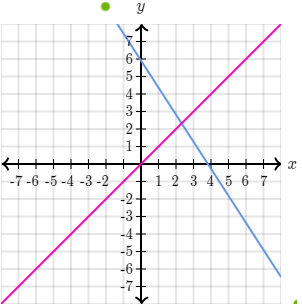
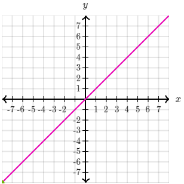
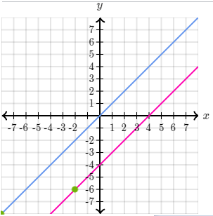

# -*- coding: utf-8 -*-
---
jupyter:
  jupytext:
    formats: ipynb,py:percent,md
    text_representation:
      extension: .md
      format_name: markdown
      format_version: '1.2'
      jupytext_version: 1.4.1
  kernelspec:
    display_name: Python 3
    language: python
    name: python3
---

```python
import pandas as pd
import numpy as np
from jupyterthemes import jtplot
from IPython.core.display import display, HTML

display(HTML("<style>.container { width:80% !important; }</style>"))
jtplot.style()
```

## 代數基礎

<!-- #region -->
* inequalities (不等式)  
${若c為 正數 且 a > b；則 ac > bc}$   
${若c為 正數 且 a < b；則 ac < bc}$     
${若c為 負數 且 a > b；則 ac < bc}$     
${若c為 負數 且 a < b；則 ac > bc}$    
${-2x > 20}\Rightarrow{x < \frac{20}{-2}}$    
* linear equations (線性方程式/一次方程式)  
所有解可以在座標圖上形成一直線  


* intercepts (截距)  
線性方程式於座標上畫出一直線.  
該線段通過 ${x}$  軸處為 x-intercepts, 該點座標為${(n, 0)}$   
該線段通過 ${y}$  軸處為 y-intercepts, 該點座標為${(0, n)}$    

* slope (斜率)   
  * ${y}$ 軸增加的量除以 ${x}$ 軸增加的量,  
  * ${x}$ 軸每增加 1, ${y}$軸的變化量(增加或減少)
  * slope = $\frac{\Delta{y}}{\Delta{x}}$ 
* 兩點斜率
  * ${a(x1,\;y1),\;b(x2,\;y2)}$,  兩點互減方向正確就可, ${a-b} 或 {b-a}$都可
  
  * $\frac{y1-y2}{x1-x2}$
* slope-intercept equations (斜率截距方程式) 

  * ${y = mx + b}$ 
  * ${m = slope,\;x = b ,\;y = 0}$

* System of equations (線性方程組)


 One solution | Infinitely solutions | No solutions
--- | --- | ---
||
當兩線性方程式有一點相交時, 有唯一解 | 當兩線性方程式完全重疊時, 有無限解 | 當兩線性方程式平行時, 無解
  

* functions 函數
  * $y = f(x), f(x) = 2x + 4$ 
  * domain 參數值域
  * range 回傳值範圍
* inverse functions 反函數
  * $y = f(x), f(x) = 2x + 4$ 
  * $f^{-1}(y)$

* Sequance 序列  
  * finite  ${\{a_k\}}_{k=1}^4 = \{1,\;4,\;7,\;10\}$  
    *  ${\{a_k\}}_{k=1}^4\; with\; a_k = 1+3(k-1)$  
    *  ${\{a_k\}}_{k=1}^4\; with\; a_k = a_{k-1} + 3$ 
    * ${有限序列 a,\;}$
  * infinite  ${\{a_k\}}_{k=1}^4 = \{1,\;4,\;7,\;10,\cdots\}$  
    *  ${\{a_k\}}_{k=1}^\infty\;  with\; a_k = 1+3(k-1)$    
<!-- #endregion -->
