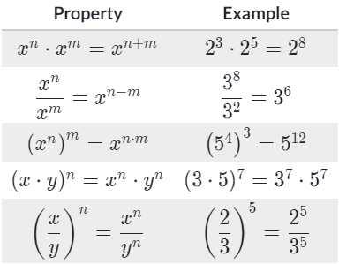

# -*- coding: utf-8 -*-
---
jupyter:
  jupytext:
    formats: ipynb,py:percent,md
    text_representation:
      extension: .md
      format_name: markdown
      format_version: '1.2'
      jupytext_version: 1.4.1
  kernelspec:
    display_name: Python 3
    language: python
    name: python3
---

```python
import pandas as pd
import numpy as np
from jupyterthemes import jtplot
from IPython.core.display import display, HTML

display(HTML("<style>.container { width:80% !important; }</style>"))
jtplot.style()
```

# Math


## 名詞解釋
純量 scalar  
* Distance, speed, time, temperature, mass, length, area, volume, density, charge, pressure, energy,   
  work and power are all scalars.
* 不具方向性, 只有大小 ( magnitude / size ): 3.044, -7, 1$\frac{1}{2}$
* 通常使用細體: A, b  

向量vactor 
* Displacement, velocity, acceleration, force and momentum are all vectors.
* 具方向性、大小,
* 通常使用粗體: **A**, **b**
* $\overrightarrow{AB}$


## 常用符號解釋

* $\Delta$ Delta = 變化量 (增加/減少)

[數學常用符號](https://zh.wikipedia.org/wiki/%E6%95%B0%E5%AD%A6%E7%AC%A6%E5%8F%B7%E8%A1%A8)

<!-- #region -->
### 指數 exponent
---

* 2$^{5}$, $^{5}$就是指數, 1 $\times$ 2 $\times$ 2 $\times$ 2 $\times$ 2 $\times$ 2 <br/>
* n$^{0}$ = 1
* n$^{1}$ = n
* 2$^{5}$ + 2$^{4}$ = 2$^{9}$
* (2$^{5}$)$^{4}$ = 2$^{20}$
* 2$^{-5}$ = $\frac{1}{2^{5}}$, 先轉化為分數再加上指數絕對值


[np.exp()](https://docs.scipy.org/doc/numpy/reference/generated/numpy.exp.html)

<!-- #endregion -->

### 對數 Logarithm
---
* 以2$^{5}$為例, $^{5}$是指數  
* 以2$^{5}$為例, $\log _{2}$$^{32}$ = 5, $\log _{2}$$^{32}$的5是對數、2是底數
* $\log _{A}$$^{C}$ = ${B}$, 意思是 "${A}$ 為底數, ${C}$指數需要多少才能得到積為${B}$ ?"  
[np.log(),歐拉數e (2.71828)](https://docs.scipy.org/doc/numpy/reference/generated/numpy.log.html)  
[np.1og2(), 以2為底數](https://docs.scipy.org/doc/numpy/reference/generated/numpy.log2.html)    
[np.log10(), 以10為底數](https://docs.scipy.org/doc/numpy/reference/generated/numpy.log10.html#numpy.log10)  


### 虛數 Imaginary
---
* i × i = −1
* i = $\sqrt{-1}$


### 平方根 Sqrt
---
[np.sqrt()](https://docs.scipy.org/doc/numpy/reference/generated/numpy.sqrt.html)
* $\sqrt{42a^4b^6} = \sqrt{2}\ast\sqrt{3}\ast\sqrt{7}\ast\sqrt{a}\ast\sqrt{a}\ast\sqrt{a}\ast\sqrt{a}\ast\sqrt{b}\ast\sqrt{b}\ast\sqrt{b}\ast\sqrt{b}\ast\sqrt{b}\ast\sqrt{b}$  
$\sqrt{42a^4b^6} = a^2b^3\sqrt{2}\ast\sqrt{3}\ast\sqrt{7}$  
$\sqrt{42a^4b^6} = a^2b^3\sqrt{42}$

```python
high_var_array = np.array([1, 100, 200, 300, 4000, 5000])
low_var_array = np.array([2, 4, 6, 8, 10])
```

### 算術平均數 Arithmetic mean
---
[np.mean()](https://docs.scipy.org/doc/numpy/reference/generated/numpy.mean.html)

```python
# Demo of std 
np.mean(high_var_array), np.mean(low_var_array)
```

### 方差/變異數 Variance
---
[np.var()](https://docs.scipy.org/doc/numpy/reference/generated/numpy.var.html)  
Variance = measure of the average degree to which each number is difference to mean  
Higher variance = wider range of numbers  
Lower variance = lower range of numbers  

```python
# Demo of var
np.var(high_var_array), np.var(low_var_array)
```

<!-- #region -->


### 標準差Standard Deviation
[np.std()](https://docs.scipy.org/doc/numpy/reference/generated/numpy.std.html)
     
---
Strandard deviation = squareroot of variance  
var = std ** 0.5  

Standard deviation = a measure of how sparead out a group of numbers is from the mean
<!-- #endregion -->

```python
# Demo of std 
np.std(high_var_array), np.std(low_var_array)
```

### 內積 Dot Product


### Element Wise
