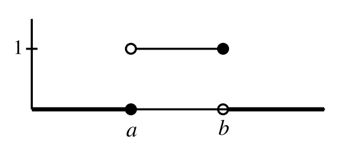

---
jupyter:
  jupytext:
    formats: ipynb,py:percent,md
    text_representation:
      extension: .md
      format_name: markdown
      format_version: '1.2'
      jupytext_version: 1.4.1
  kernelspec:
    display_name: Python 3
    language: python
    name: python3
---

# ${Statistics}$
---

#### ${Indicator function}$ 指標函數
---
$1_A{ X }:=\begin{cases}1,X\in A\\0,X\notin A \end{cases}$  
${給定任意數字\;X,\;若\;X\;屬於\;A\;集合,\;則會得到\;1(存在),\;否則得到\;0(不存在)}$

${Example1:}$
${1_{[a,b)}(X)}$  
${一指示函數，事件集合包含\;a\;不包含\;b,\;所以\;X\;是\;a\;則得到\;1,\;X\;是\;b\;則得到\;0}$

${Example2:}$
${1_{(a,b]}(X)}$  
${一指示函數，事件集合不包含\;a\;包含\;b,\;所以\;X\;是\;b\;則得到\;1,\;X\;是\;a\;則得到\;0}$  

[see also](https://ch-hsieh.blogspot.com/2012/07/indicator-function.html)
