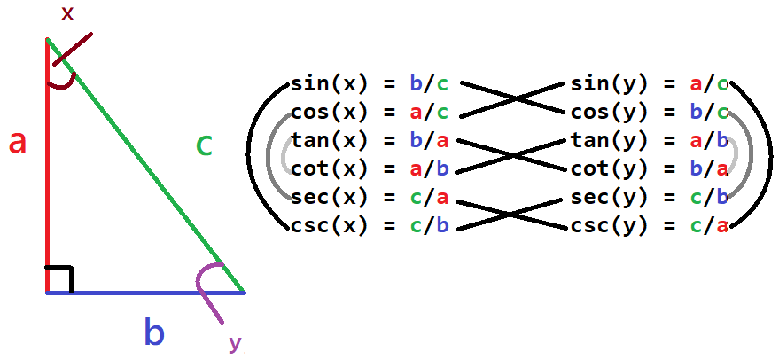
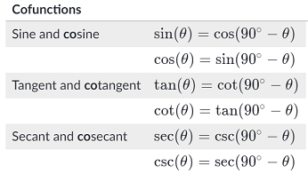

# -*- coding: utf-8 -*-
---
jupyter:
  jupytext:
    formats: ipynb,py:percent,md
    text_representation:
      extension: .md
      format_name: markdown
      format_version: '1.2'
      jupytext_version: 1.4.1
  kernelspec:
    display_name: Python 3
    language: python
    name: python3
---

```python
import pandas as pd
import numpy as np
from jupyterthemes import jtplot
from IPython.core.display import display, HTML

display(HTML("<style>.container { width:80% !important; }</style>"))
jtplot.style()
```

### 三角學
||
--- | ---
  
* `opp` = 對邊 (opposite)<br/>
* `hyp` = 斜邊 (hypotenuse)<br/>
* `adj` = 臨邊 (adjacent)<br/>
* `銳角` = $\angle$0$^\circ$ ~ $\angle$90$^\circ$<br/>   
* $\bigtriangleup$ABC與$\bigtriangleup$DEF即使角度相同, 且已知$\bigtriangleup$ABC部份邊長<br/> 
仍不能套用三角形函數來推算$\bigtriangleup$DEF的邊長

### 銳角三角形口訣: soh、cah、toa<br/> 
##### 三角函數 Trigonometric functions <br/>

* 多用來求邊長<br/>
* Parameters: 內角角度<br/>
* Return: 比值, 內角與兩邊長(opp、adj、hyo擇二)的比值關係<br/>
* Note: 回傳值(邊長比值)可與已知邊長推導出未知邊長<br/>

`正弦`<br/>
$\sin$($\angle$A) = $\frac{opp}{hyp}$<br/>
$\sin$($\angle$A) = $\cos$($\angle$B)<br/>
`餘弦`<br/>
$\cos$($\angle$A) = $\frac{adj}{hyp}$<br/>
$\cos$($\angle$A) = $\sin$($\angle$B)<br/> 
`正切`<br/> 
$\tan$($\angle$A) = $\frac{opp}{adj}$<br/>

##### 反三角函數 Inverse trigonometric functions<br/>

* 多用來求角度<br/>
* Parameters: 比值, 內角與兩邊長(opp、adj、hyo擇二)的比值<br/>
* Return: 內角角度<br/>
* Note: <br/>

`正弦` <br/> 
$\sin$$^{-1}$($\angle$A) = $\frac{opp}{hyp}$<br/> 
$\angle$A = $\sin$$^{-1}$($\frac{opp}{hyp}$)<br/>
$\angle$A = $\sin$$^{-1}$($\frac{BC}{AB}$)<br/>

`餘弦`<br/> 
$\cos$$^{-1}$($\angle$A) = $\frac{adj}{hyp}$<br/> 
$\angle$A = $\cos$$^{-1}$($\frac{adj}{hyp}$)<br/>
$\angle$A = $\cos$$^{-1}$($\frac{AC}{AB}$)<br/>
`正切`<br/> 
$\tan$$^{-1}$($\angle$A) = $\frac{opp}{adj}$<br/> 
$\angle$A = $\tan$$^{-1}$($\frac{opp}{adj}$)<br/>
$\angle$A = $\tan$$^{-1}$($\frac{BC}{AC}$)<br/>

##### 正弦定理<br/>
||
--- | ---  
[正弦定理](https://zh.wikipedia.org/wiki/%E6%AD%A3%E5%BC%A6%E5%AE%9A%E7%90%86)  <br/>

##### 餘弦定理<br/>
* 當知道三角形的兩邊和一角時，餘弦定理可被用來計算第三邊的長，或是當知道三邊的長度時，可用來求出任何一個角。

[餘弦定理](https://zh.wikipedia.org/wiki/%E9%A4%98%E5%BC%A6%E5%AE%9A%E7%90%86)  <br/>
##### 直角三角形角度互補關係<br/>
|
--- | ---
  


#### 應用
---


* 三角形使用正弦定理求邊長  
$\bigtriangleup$ABC, $\frac{\sin\angle{A}}{a}$ = $\frac{\sin\angle{B}}{b}$ = $\frac{\sin\angle{C}}{c}$
* 三角形使用三角函數算角度

```python
opp = 3
adj = 4
hyp = 5
# 有opp與hyp要計算角度
np.arcsin(opp/hyp)

# 有adj與hyp要計算角度
np.arccos(adj/hyp)

# 有opp與adj要計算角度
np.arctan(opp/adj)
```
