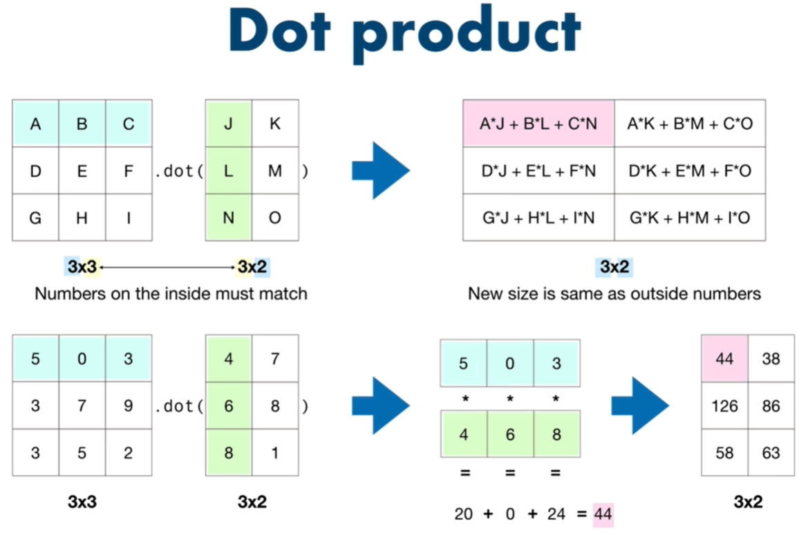

# -*- coding: utf-8 -*-
---
jupyter:
  jupytext:
    formats: ipynb,py:percent,md
    text_representation:
      extension: .md
      format_name: markdown
      format_version: '1.2'
      jupytext_version: 1.4.1
  kernelspec:
    display_name: Python 3
    language: python
    name: python3
---

```python
import pandas as pd
import numpy as np
from jupyterthemes import jtplot
from IPython.core.display import display, HTML

display(HTML("<style>.container { width:80% !important; }</style>"))
jtplot.style()
```

## DataTypes & Attributes

```python
# NumPy's main datatype is ndarray
# n dimensional array
# 所有的 Data 都會轉換為數字來進行機器學習, 
# 所以需要極為複雜的維度來組織 Data (數值)
a1 = np.array([1, 2, 3])
a1
```

```python
type(a1)
```

```python
a2 = np.array([[1, 2.0, 3.3], [4, 5, 6.5]])
a3 = np.array([[[1, 2, 3],
                [4, 5, 6],
                [7, 8, 9]],
               [[10, 11, 12],
                [13, 14, 15],
                [16, 17, 18]]])
a4 = np.array([[[[2, 3],
                 [2, 3],
                 [2, 3]],
                [[2, 3],
                 [2, 3],
                 [2, 3]],
                [[2, 3],
                 [2, 3],
                 [2, 3]]],
               [[[2, 3],
                 [2, 3],
                 [2, 3]],
                [[2, 3],
                 [2, 13],
                 [2, 3]],
                [[2, 3],
                 [2, 3],
                 [2, 3]]]]

              )
```

```python
a2
```

```python
a3.shape
```

```python
a4.shape
```

```python
a1.ndim, a2.ndim, a3.ndim, a4.ndim
```

```python
a1.size, a2.size, a3.size, a4.size
```

```python
# Create a DataFrame from a NumPy array
pd.DataFrame(a2)
```

## 2. Creating Arrays

```python
sample_array = np.array([1, 2, 3])
sample_array
```

```python
sample_array.dtype
```

```python
ones = np.ones([1, 2])
ones
```

```python
zeros = np.zeros([1, 2])
zeros
```

```python
range_array = np.arange(0, 10, 2)
range_array
```

```python
random_array = np.random.randint(1, 10, size=(3, 3, 3))
random_array
```

```python
random_array.size
```

```python
random_array.shape
```

```python
random_array2 = np.random.random((5, 3))
random_array2
```

```python
random_array_3 = np.random.rand(5, 3)
random_array_3
```

```python
# Pseudo-random number
# 隨機的只有種子編碼, 所以種子編碼固定後, 得到的亂數都會相同
np.random.seed(1)
random_array_4 = np.random.randint(10, size=(5, 3))
random_array_4
```

## 3. Viewing arrays and 

```python
np.unique(random_array_4)
```

```python
random_array
```

```python
random_array[:2, :2, :2]
```

```python
a5 = np.random.randint(10, size=(2, 3, 4, 5))
a5.shape, a5.ndim
```

```python
# Get the first 4 numbers of the inner most arrays
a5
```

```python
a5[:1, :2, :3, :4]
```

## 4. Manipulating & comparing arrays


### Arithmetic

```python
a1
```

```python
ones = np.ones(3)
ones
```

```python
a1 + ones
```

```python
a2
```

```python
a3
```

```python
# 同一維度必須相等或其中一方為1
a3[:, :2, :1]
```

```python
a3.reshape(3, 2, 3)
a3
```

```python
a1 / ones
```

```python
# Floor division removes the decimals (rounds down)
a2 / a1
```

```python
a2 // a1
```

```python
a2 ** 2
```

```python
np.square(a2)
```

```python
a1 + ones
```

```python
np.add(a1, ones)
```

```python
a2
```

```python
a2 % 2
```

```python
np.log(a1)
```

## Aggregation
Aggregation = performing the same operation on a number of things

```python
listy_list = [1, 2, 3]
type(listy_list)
```

```python
sum(listy_list)
```

```python
a1
```

```python
type(a1)
```

```python
np.sum(a1)
```

User Python's method( `sum()` ) on Python datatypes and use NumPy's methods on NumPy arrays( `np.sum()` )

```python
# Creative a massive NumPy array
massive_array = np.random.random(100000)
massive_array.size
massive_array[:10]
```

```python
%timeit sum(massive_array) # Python's sum() 
%timeit np.sum(massive_array) # NumPy's sum()
```

```python
a2
```

```python
np.mean(a2)
```

```python
np.max(a2) ,np.min(a2), np.std(a2)
```

## Reshaping & transposing

```python
a2
```

```python
a2.shape
```

```python
a2.reshape(2, 3, 1)
```

```python
a2.shape
```

```python
a2.T.shape
```

<!-- #region -->



## Element-wise multiplication (Hadamard product)
* follow broadcast rule, size必須完全相等, 或其中一方為1  

 
arrayA | arrayB | math | describe
--- | --- | --- | ---
size(1, 2, 3)|size(1, 2, 3)| O | size 相等
size(1, 2, 3)|size(3, 2, 3)| X | size 不全等
size(1, 2, 9)|size(9, 1, 1)| O | size 不相等但該維度其中為1
size(3, 6, 2)|size(3, 6)| X | 維度不對 (維度數由右而左升冪)
size(3, 6, 2)|size(6, 2)| O | 
<!-- #endregion -->

```python
np.random.seed(1)
e_array_1 = np.random.randint(1, 10, size=(3, 6, 1))
e_array_2 = np.random.randint(1, 10, size=(6, 1))
e_array_1 * e_array_2
```

## Dot product
* 
* 兩元素的


```python
np.random.seed(1)
dot_1 = np.random.randint(1, 10, size=(3, 2))
dot_2 = np.random.randint(1, 10, size=(2, 3))
np.dot(dot_1, dot_2)
```

## Dot product exmaple (nut butter sales)

```python
np.random.seed(0)
# Number of jars sold
sales_amounts = np.random.randint(20, size=(5, 3))
sales_amounts
```

```python
weekly_sales = pd.DataFrame(sales_amounts,
              index=['Mon', 'Tues', 'Wed', 'Thurs', 'Fri'],
              columns=['Almond butter', 'Peanut butter', 'Cashew butter'])
weekly_sales
```

```python
# Create prices array
prices = np.array([10, 8, 12])
prices
```

```python
# Create butter_price DataFrame
# 陣列轉換為pd.DataFrame時, 若為一維陣列須明確轉換形狀(reshape)為 1 row n column
butter_prices = pd.DataFrame(prices.reshape(1, 3),
                           index=['Price'],
                           columns=['Almond butter', 'Peanut butter', 'Cashew butter'])
butter_prices
```

```python
# Shaoe aren't aligned, let's transpose
total_sales = prices.dot(sales_amounts.T)
total_sales
```

```python
sales_amounts_T = sales_amounts.T
sales_amounts_T
```

```python
# Create daily_sales
butter_prices

```

```python
np.random.seed(0)
# Number of jars sold
sales = np.random.randint(20, size=(5, 3))
sales.shape

```

```python
# Create prices array
price = np.array([10, 8, 12])
price = price.reshape(1, 3)
price.shape
```

```python
sales.dot(price.T)
```

```python
price.dot(sales.T)
```

```python
# Create daliy_sales
butter_prices.shape, weekly_sales.shape
```

```python
weekly_sales.T.shape
```

```python
daliy_sales = butter_prices.dot(weekly_sales.T)
daliy_sales
```

```python
weekly_sales['Total ($)'] = daliy_sales.T
weekly_sales
```

## Comparison Operators

```python
a1
```

```python
a2
```

```python
a1 > a2
```

```python
a1 >= a2
```

```python
bool_array = a1 >= a2
type(bool_array), bool_array.dtype
```

## Sorting arrays

```python
np.random.seed(1)
random_array = np.random.randint(10, size=(3, 5))
random_array
```

```python
np.sort(random_array)
```

```python
# 回傳各維度index, 以'值'由小而大排序
np.argsort(random_array)
```

```python
# 返回最小、返回最大
np.argmin(a1), np.argmax(a1)
```

```python
random_array
```

```python
np.argmax(random_array, axis=0)
```

```python
np.random.seed(0)
r = np.random.randint(100, size=(7, 6, 5, 4, 3))
r
```

```python
# axis0 = 1d (row)
# axis1 = 2d (cloumn)
# axis2 = 3d ()
# axisn = nd -1
np.argmax(r, axis=4)
```

```python

```

```python

```
