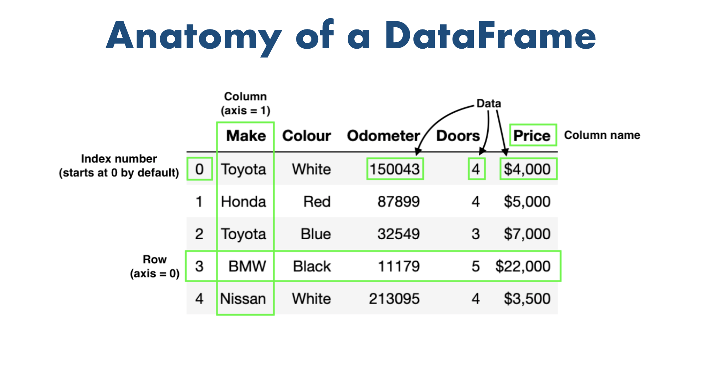

# -*- coding: utf-8 -*-
---
jupyter:
  jupytext:
    formats: ipynb,py:percent,md
    text_representation:
      extension: .md
      format_name: markdown
      format_version: '1.2'
      jupytext_version: 1.4.1
  kernelspec:
    display_name: Python 3
    language: python
    name: python3
---

```python
import pandas as pd
from jupyterthemes import jtplot

jtplot.style()
```

```python
# 2 main datatypes
series = pd.Series(['BMW', 'Toyota', 'Honda'])
series
```

```python
# Series = 1-dimensional
```

```python
colos = pd.Series(['Red', 'Blue', 'White'])
colos
```



```python
# DataFrame = 2-dimensional
car_data = pd.DataFrame({'Car make': series, 'Colour': colos})
car_data
```

```python
# Import data
car_sales = pd.read_csv('./source/car_sales.csv')
car_sales
```

```python
# Export data
# 若資料有多餘的index 欄位，要加入參數index=False 去除
car_sales.to_csv('./source/exported_car_sales.csv', index=False)
```

```python
exported_car_sales = pd.read_csv('./source/exported_car_sales.csv')
exported_car_sales
```

```python
# read_csv('some_url')
```

```python
heart_disease = pd.read_csv(
    "https://raw.githubusercontent.com/mrdbourke/zero-to-mastery-ml/master/data/heart-disease.csv")
heart_disease
```

```python
# Practice area
```

```python
# Series has arg (data, index)
user_names = ['Simon', 'Belinda', 'Troll']
user_hight = [170, 154, 6]
user_width = [65, 50, 0.013]
users_h = pd.Series(data=user_hight, index=user_names)
users_w = pd.Series(data=user_width, index=user_names)
```

```python
# Series 引數可以dict
user = pd.Series({'name': 'Simon', 'age': 32})
user
```

```python
# Series 引數也可以list,tuple
user = pd.Series(('Simon', 32))
user
```

```python
# DataFrame has arg (index, data, columns)
users = pd.DataFrame({'Hight': users_h, 'Width': users_w})
users['BMI'] = users['Width'] / ((users['Hight'] / 100) ** 2)
users
```

```python
# 資料轉置
users.T
```

## Describe data

```python
car_sales.dtypes
```

```python
car_sales.columns
```

```python
car_columns = car_sales.columns
car_columns
```

```python
car_sales.index
```

```python
car_sales.describe()
```

```python
car_sales.info()
```

```python
# .mean() 只會算出DataFrame 中可以計算的type的算術平均數(mean)
car_sales.mean()
```

```python
car_prices = pd.Series([3000, 1500, 111250])
car_prices.mean()
```

```python
car_sales.sum()
```

## Viewing and selecting data

```python
# top 5 row 
car_sales.head()
```

```python
# bottom 5 row
car_sales.tail()
```

```python
# .loc & .iloc
animals = pd.Series(['cat', 'dog', 'bird', 'panda', 'snake'], index=[0, 3, 9, 8, 3])
animals
```

```python
# .iloc refers to position
animals.iloc[3]
```

```python
# .loc refers to index
car_sales.loc[3]
```

```python
animals.iloc[:3]
```

```python
car_sales['Make']
```

```python
car_sales.Colour
```

```python
car_sales[car_sales['Make'] == 'Toyota']
```

```python
car_sales[car_sales['Odometer (KM)'] > 100000]
```

```python
pd.crosstab(car_sales['Make'], car_sales['Doors'])
```

```python
# Groupby
# 將DataFrame 物件依 column groupby(分組),
# 分組後的DataFrameGroupBy object 可以再做運算
car_sales.groupby(['Make']).mean()
```

```python
car_sales['Odometer (KM)'].plot()
# 如果程式碼無法產生圖片，可以做以下處理
# %matplotlib inline
# import maatplotlib.pyplot as plt
```

```python
car_sales['Odometer (KM)'].hist()
```

```python
car_sales['Price'] = car_sales['Price'].str.replace('[\$\,\.]', '').astype(int)
car_sales['Price'].plot()
```

## Manipulating Data

```python
car_sales['Make'] = car_sales['Make'].str.lower()
```

```python
car_sales
```

```python
car_sales_missing = pd.read_csv('./source/car_sales_missing_data.csv')
```

```python
car_sales_missing
```

```python
car_sales_missing['Odometer'].fillna(car_sales_missing['Odometer'].mean(), inplace=True)
```

```python
car_sales_missing
```

```python
# missing data process
missing_data_drop = pd.read_csv('./source/car_sales_missing_data.csv')
missing_data_drop.dropna(inplace=True)
```

```python
missing_data_drop.to_csv('./source/car_sales_droped.csv')
```

```python
# Column from series
seats_column = pd.Series([5, 5, 5, 5, 5])

# New column called seats
car_sales['Seats'] = seats_column
car_sales
```


```python
car_sales['Seats'].fillna(5, inplace=True)
car_sales
```

```python
# Column from Python list
fuel_economy = [7.5, 9.2, 5.0, 9.6, 8.7, 4.7, 7.6, 8.7, 3.0, 4.5]
car_sales['Fuel per 100KM'] = fuel_economy
car_sales
```

```python

```
