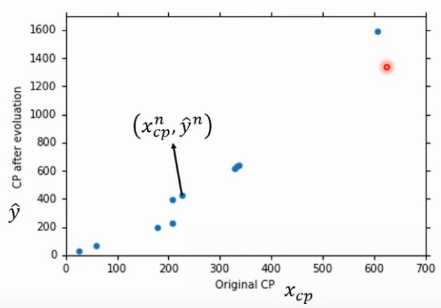

# -*- coding: utf-8 -*-
---
jupyter:
  jupytext:
    formats: ipynb,py:percent,md
    text_representation:
      extension: .md
      format_name: markdown
      format_version: '1.2'
      jupytext_version: 1.4.2
  kernelspec:
    display_name: Python 3
    language: python
    name: python3
---

# ${Regression}$
---

<!-- #region -->
Pokemon  
${y\;=\;經由model推算出來的結果}$  
${b\;=\;bias}$  
${w\;=\;weight}$  
${X\;=\;經由\;model\;推算出來的結果}$  
${X_{cp}\;=\;下標代表特徵\;feature, 所以\;cp\;是\;object\;X\;的特徵}$   
${X_i\;=\;an\;atrribute\;of\;inout\;X\;(X的所有feature)}$  
${w_i\;=\;weight}$  
${b_i\;=\;bias}$  
${X^1\;=\;上標\;^1數字代表\;function\;input\;的編號}$  
${\hat{y}^1\;=\;上蓋\;\hat\;代表\;function\;ouput\;應該得到的,也就是\;lebal、real\;data}$



#### Step 1:Model  
${y\;=\;b\;+\;w\;*\;X_{cp}}$  
#### Step 2:Goodness of Function  
${Loss\;function\;:\;L}$  
${L(f)=L(w,b)}$  
${\;\;\;\;\;\;\;=\sum_{n=1}^{10}(\hat{y}^n-(b+w*X_{cp}^{n}))^2}$  
input: a function  
output: how bad it is    

#### Step 3:Best Function  
找尋通過 loss function 後表現最佳的 function  
${f^*\;=arg\;\underset{f}min\;L(f)}$  
${w^*,\;b^*\;=arg\;\underset{w,b}min\;L(w,b)}$  

#### Steo 3:Gradient Descent
* Consider loss function ${L(w)}$ with one parameter ${w}$:
  * (Randomly) Pick an inital value ${w^0}$  
    首先, 隨機選取一個值 ${w^0}$  
  * Compute
    計算${w^0}對 loss function 的微分 (切線斜率)$

<!-- #endregion -->

```python

```

```python

```
